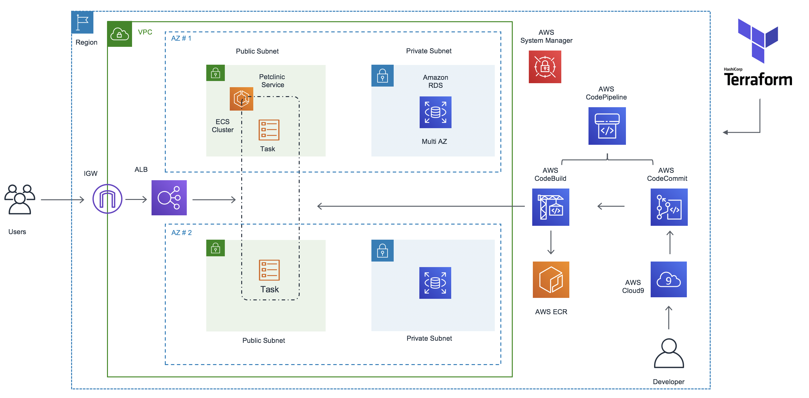

# ECS Terraform side-project

## Description
ECS Terraform and pipeline workflow

## Architecture

## Completed
- Terraform ECS design architecutre
- ECS module definition

## In-progress
- AWS CodePipeline, AWS CodeBuild, AWS CodeCommit
- Deployment guide
- Extension with Terragrunt and Terratest
- Clean up

## License
Distributed under the MIT License. See [LICENSE](./LICENSE) for more information.
